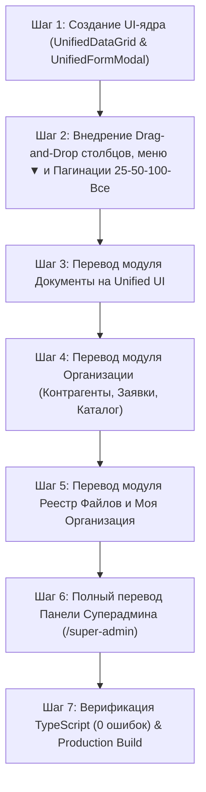

# Имплементационный План: Полная Унификация Дизайна, Таблиц и Форм Системы (Unified UI Framework)

Данный документ содержит архитектурный план разработки единого универсального UI-ядра (**Unified UI Framework**) и перевода ВСЕХ модулей платформы Buhuchet.kg (включая Панель Суперадмина) на единый стандарт интерфейсов, таблиц и форм.

---

## 🎨 1. ОСНОВНЫЕ ТРЕБОВАНИЯ И КОНЦЕПЦИЯ ЕДИНОГО СТИЛЯ

Пользовательские интерфейсы во всех модулях приводятся к строгому единому стилю премиального темного дизайна (Slate-900 / Amber / Emerald / Indigo) с наследованием от двух базовых универсальных компонентов:

1. **`UnifiedDataGrid<T>`** — Универсальный реестр (Таблица/Карточки, D&D столбцов, Выпадающее меню с треугольником, контроль видимости, пагинация 25-50-100-Все).
2. **`UnifiedFormModal<T>`** — Единый стандартизированный диалог/шторка с 3 режимами (Просмотр / Создание / Редактирование).

---

## 🛠️ 2. ДЕТАЛЬНАЯ АРХИТЕКТУРА ОБЩИХ КОМПОНЕНТОВ

### 2.1 Базовый Компонент Таблиц и Карточек `UnifiedDataGrid<T>`
**Путь:** `components/ui/unified/UnifiedDataGrid.tsx`

#### Ключевые возможности:
1. **Автоматическое и ручное переключение Вида (Таблица / Сетка Карточек):**
   - **На ПК (`width >= 768px`):** по умолчанию включается информативная **Таблица**.
   - **На Мобильных устройствах (`width < 768px`):** по умолчанию включается **Сетка Адаптивных Карточек**.
   - На верхней панели реестра располагаются кнопки принудительного переключения вида (Иконка Таблицы / Иконка Карточек).
2. **Пагинация с выбором размера страницы (25 / 50 / 100 / Все):**
   - Переключатель количества отображаемых записей: `25`, `50`, `100` или `Все (Без ограничений)`.
   - Информационная плашка («Показано 1–25 из 140 записей»).
   - Кнопки переключения страниц (`Назад`, `Вперед`, номера страниц).
3. **Перетягивание столбцов мышкой (Drag & Drop Column Reordering):**
   - Каждый заголовок таблицы `TableHead` поддерживает свойство `draggable`.
   - При перетягивании заголовка столбца мышкой порядок столбцов меняется местами на лету с сохранением нового порядка в состояние компонента.
4. **Кнопка с перевернутым треугольником на каждом столбце (Column Context Menu):**
   - В каждом заголовке столбца рядом с названием расположена кнопка с перевернутым треугольником (`▼` / `ChevronDown`).
   - При нажатии открывается Popover-меню с функциями:
     - 🔼 **Сортировка по возрастанию** (`ASC`).
     - 🔽 **Сортировка по убыванию** (`DESC`).
     - 🔍 **Фильтр по столбцу** (Быстрый ввод текста или чекбоксы значений).
     - 👁️ **Скрыть столбец**.
5. **Панель Контроля Видимости Столбцов (Column Visibility Dropdown):**
   - Кнопка **«Столбцы»** со списком всех доступных полей и чекбоксами для мгновенного включения/отключения столбцов.

---

### 2.2 Базовый Компонент Форм `UnifiedFormModal<T>`
**Путь:** `components/ui/unified/UnifiedFormModal.tsx`

#### Режимы работы (3-in-1 Form Engine):
1. **👁️ Режим Просмотра (`mode: 'view'`):**
   - Структурированная карточка с полями «только для чтения», подсвеченными статусами, пресайн-ссылками R2 и кнопкой «Перейти к редактированию».
2. **➕ Режим Создания (`mode: 'create'`):**
   - Форма с валидацией Zod, сжатием изображений на клиенте (`browser-image-compression`) и кнопкой загрузки сканов в Cloudflare R2.
3. **✏️ Режим Редактирования (`mode: 'edit'`):**
   - Заполненная форма изменения данных записи.

---

## 🗺️ 3. ПЕРЕВОД ВСЕХ МОДУЛЕЙ СИСТЕМЫ НА ЕДИНЫЙ СТИЛЬ

Вся система переводится на использование `UnifiedDataGrid` и `UnifiedFormModal`:

### 3.1 Модуль «Документы B2B» (`/dashboard/documents`)
- **Реестр документов:** Перевод таблицы на `UnifiedDataGrid` (Таблица на ПК / Карточки на телефоне, пагинация 25-50-100-Все, меню у столбцов с кнопкой-треугольником, D&D столбцов, видимость).
- **Формы:** Единая модалка просмотра, создания и редактирования черновиков B2B накладных.

### 3.2 Модуль «Организации» (`/dashboard/counterparties`)
- **Вкладка «Контрагенты»:** `UnifiedDataGrid` со статистикой взаиморасчетов и сканами R2.
- **Вкладка «Заявки»:** `UnifiedDataGrid` с 5 статусами и быстрыми действиями.
- **Вкладка «Каталог Организаций»:** `UnifiedDataGrid` с группировкой по категориям/отраслям.
- **Форма:** `UnifiedFormModal` просмотра реквизитов и уставных сканов R2.

### 3.3 Модуль «Реестр Файлов» (`/dashboard/files`)
- **Реестр сканов R2:** `UnifiedDataGrid` с видом источника (Документы, Моя организация, Контрагенты, Ручной), ссылками на первоисточники и калькулятором диска.

### 3.4 Модуль «Моя Организация» (`/dashboard/company`)
- **Уставные документы:** Таблица и форма загрузки сканов в R2 по единому стандарту.

### 3.5 Панель Суперадмина (`/super-admin`)
- **Все 5 разделов суперадмина:**
  - **Все Организации КР:** `UnifiedDataGrid` с модальным окном модерации (`UnifiedFormModal`).
  - **Все Документы Системы:** `UnifiedDataGrid` с просмотром позиций.
  - **Все Файлы R2:** `UnifiedDataGrid` с дисковыми метриками.
  - **Все Пользователи:** `UnifiedDataGrid` с назначением ролей.
  - **Тарифы и Подписки:** `UnifiedDataGrid` и форма редактирования лимитов R2.

---

## 📅 4. ПОШАГОВЫЙ ПЛАН РЕАЛИЗАЦИИ

### Этап 1: Создание UI-Ядра Framework
- Разработка `UnifiedDataGrid.tsx` с поддержкой переключения Таблица/Карточки, D&D столбцов, контекстного меню с перевернутым треугольником, видимости и пагинации `25 / 50 / 100 / Все`.
- Разработка `UnifiedFormModal.tsx` с режимами `view`, `create`, `edit`.

### Этап 2: Рефакторинг Пользовательских Разделов (`/dashboard/*`)
- Рефакторинг `/dashboard/documents/page.tsx`
- Рефакторинг `/dashboard/counterparties/page.tsx`
- Рефакторинг `/dashboard/files/page.tsx`
- Рефакторинг `/dashboard/company/page.tsx`

### Этап 3: Рефакторинг Панели Суперадмина (`/super-admin`)
- Перевод всех таблиц и форм раздела суперадмина на `UnifiedDataGrid` и `UnifiedFormModal`.

### Этап 4: Верификация
- Выполнение `npx tsc --noEmit` для проверки отсутствие типов `any` и ошибок.
- Выполнение `npm run build` (21 static page).
