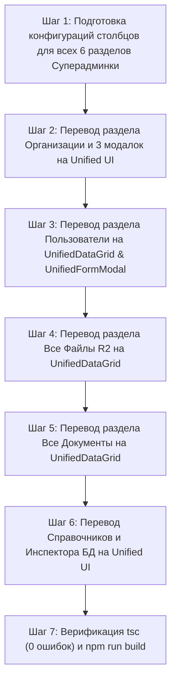

# Имплементационный План: Полный Перевод Панели Суперадминистратора на Unified UI Framework

Данный документ содержит архитектурный план полного перевода **Панели Суперадминистратора** (`/super-admin`) на единый стандарт интерфейсов, таблиц и форм **Unified UI Framework**.

---

## 🏛️ 1. АРХИТЕКТУРА И ТРЕБОВАНИЯ ДЛЯ СУПЕРАДМИНКИ

Все 6 функциональных разделов Панели Суперадминистратора переводятся на базовые компоненты UI-ядра:

1. **`UnifiedDataGrid<T>`** — Для всех 6 реестров Суперадминки:
   - **Авто-переключение Вида:** Таблица на ПК (`≥ 768px`) / Сетка Карточек на смартфонах (`< 768px`) с тумблером ручного переключения.
   - **Пагинация (25 / 50 / 100 / Все):** Оптимизированный выбор размера страницы и точный подсчёт.
   - **Drag & Drop Перетягивание столбцов:** Захват мышки и изменение порядка колонок.
   - **Контекстное меню столбцов с кнопкой-треугольником (`▼`):** Сортировка `ASC/DESC`, быстрый фильтр по столбцу и скрытие.
   - **Контроль видимости столбцов:** Панель «Столбцы» с чекбоксами.

2. **`UnifiedFormModal<T>`** — Для всех 5 модальных диалогов Суперадминки:
   - Режимы `view`, `create`, `edit` с Zod-валидацией, едиными стилями и кнопками действий.

---

## 🛠️ 2. ДЕТАЛИЗАЦИЯ ПЕРЕВОДА РАЗДЕЛОВ ПАНЕЛИ СУПЕРАДМИНА

### 2.1 Раздел 1: Управление Организациями (`activeTab === 'companies'`)
- **Таблицы `UnifiedDataGrid<Company>`:**
  - Перевод всех 3 подвкладок (*Все Организации*, *На верификации*, *Требующие внимания / Заблокированные*) на `UnifiedDataGrid`.
  - Столбцы: ИНН КР, Название, Руководитель, Статус, Дата регистрации, Отрасль, Действия модерации.
- **Формы `UnifiedFormModal`:**
  - **Модалка 1 (Модерация/Блокировка):** Единое диалоговое окно `UnifiedFormModal` для ввода причины затребования изменений или блокировки.
  - **Модалка 2 (Создание организации):** Форма `UnifiedFormModal` с режимом `create`.
  - **Модалка 3 (Редактирование профиля):** Форма `UnifiedFormModal` с режимом `edit`.

### 2.2 Раздел 2: Управление Пользователями (`activeTab === 'users'`)
- **Таблица `UnifiedDataGrid<User>`:**
  - Столбцы: ФИО Пользователя, Email, Название компании (ИНН), Роль (`owner`, `accountant`, `manager`), Флаг `SuperAdmin`, Дата регистрации, Действия.
- **Форма `UnifiedFormModal`:**
  - Единая модалка редактирования прав, роли и назначения статуса `is_super_admin`.

### 2.3 Раздел 3: Все Файлы Облака R2 (`activeTab === 'files'`)
- **Таблица `UnifiedDataGrid<DocumentFile>`:**
  - Столбцы: Имя файла, Категория скана, Организация-владелец, Размер (MB/KB), Дата загрузки, Кнопка скачивания R2 Presigned URL.

### 2.4 Раздел 4: Реестр Всех Документов Системы (`activeTab === 'documents'`)
- **Таблица `UnifiedDataGrid<Document>`:**
  - Столбцы: № Документа, Тип (Реализация, Закуп, Оплата, Авансовый), Компания-отправитель, Компания-получатель, Сумма (сом), Статус, Дата, Действия.
- **Форма `UnifiedFormModal`:**
  - Модальное окно просмотра/корректировки параметров документа.

### 2.5 Раздел 5: Справочники и Тарифные Категории (`activeTab === 'lookups'`)
- **Таблица `UnifiedDataGrid<FileCategory>`:**
  - Столбцы: Наименование категории, Системный код, Описание, Кол-во привязанных файлов, Действия.
- **Форма `UnifiedFormModal`:**
  - Модальное окно создания новой категории сканов R2.

### 2.6 Раздел 6: Инспектор Таблиц БД (`activeTab === 'database'`)
- **Таблица `UnifiedDataGrid<Record<string, any>>`:**
  - Динамический вывод полей любой таблицы PostgreSQL с пагинацией `25 / 50 / 100 / Все` и поиском.

---

## 📅 3. ПОШАГОВЫЙ ПЛАН РЕАЛИЗАЦИИ

---

## ❓ ВОПРОС К ПОЛЬЗОВАТЕЛЮ

Ознакомьтесь с подробным Планом Имплементации перевода Панели Суперадминистратора. Подтверждаете ли вы предложенную архитектуру?
